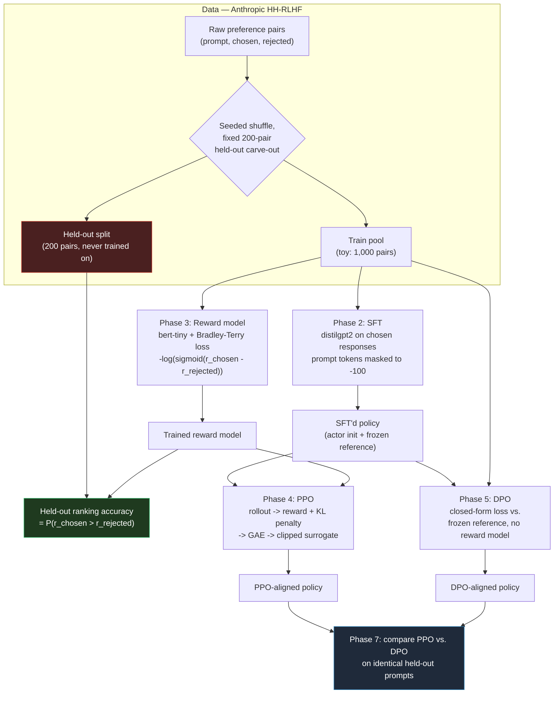
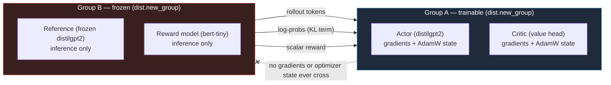

# RLHF from Scratch — SFT + Bradley-Terry Reward + PPO + DPO

A hand-written RLHF alignment stack — no `trl`. SFT, Bradley-Terry reward
modeling, PPO, and DPO are all implemented directly in PyTorch: every loss,
every gradient path, every masking convention is code you can read line by
line, not a framework call. Built to run end-to-end on a single consumer GPU
(RTX 5080, 16GB) with a `distilgpt2` actor and `bert-tiny` reward model.

> **Status: in development.** See [PLANNING.md](PLANNING.md) for the full
> phased plan and current progress. The headline numbers below are measured
> from the completed toy runs on an RTX 5080; they are not estimates.

---

## Why this exists

Most public RLHF walkthroughs wrap [`trl`](https://github.com/huggingface/trl)
and call it done — you get a working pipeline, but the actual PPO/DPO math
(clipping, GAE, KL penalties, the Bradley-Terry objective) stays hidden inside
someone else's library. This repo goes the other way: every training loop
here is a plain PyTorch loop, every RL/preference-learning loss is derived and
implemented by hand, and every claim in the project summary is backed by a
unit test or a real measured number — never a guess.

## Summary

- Implemented the RLHF stack from scratch, hand-writing SFT, Bradley-Terry reward
  modeling, PPO and DPO losses instead of wrapping `trl`.
- Built PPO with a clipped surrogate objective, GAE advantages and KL penalty,
  ending at **0.0785** mean KL against the frozen reference model.
- Split trainable actor-critic from frozen reference-reward across two process
  groups, measuring **34.48%** VRAM reduction and **0%** bytes-exchanged
  reduction across the group boundary vs. a single merged group.
- Ran a distilgpt2 and bert-tiny toy pipeline end-to-end on one GPU, with the
  reward model ranking **41.5%** of held-out pairs correctly.

---

## Architecture

### Training pipeline

Four stages, each independently runnable, sharing one preference dataset and
one held-out split that's never trained on:



### Distributed topology (Phase 6)

Trainable models (actor + critic) and frozen models (reference + reward) run
in two separate process groups. Only small scalars/tensors cross the
boundary — never gradients or optimizer state:



On the RTX 5080 this runs as **two processes sharing one physical GPU**
(`torch.multiprocessing.spawn`, each capped via
`set_per_process_memory_fraction`) — no rented hardware needed. That setup
gives real, honest numbers for **VRAM reduction** (per-process memory
footprint — genuinely real regardless of physical topology) and **bytes
exchanged across the group boundary** (a real byte count). It does **not**
support a real wall-clock/bandwidth communication-savings claim, since two
processes on one GPU share the same on-die path — see
[PLANNING.md](PLANNING.md)'s hardware plan for the full reasoning.

---

## Repo layout

```
src/rlhf_scratch/
  data/           preference_dataset.py — HH-RLHF loading, toy/held-out split,
                  three collate_fns (reward, SFT, DPO)
  models/         reward_model.py (bert-tiny + scalar head),
                  critic.py (causal-LM backbone + per-token value head)
  training/       sft.py, reward.py, ppo.py, dpo.py — every loss and training
                  loop hand-written, no trl
  distributed/    topology.py (two dist.new_group()s), comm_hooks.py
                  (byte-counted cross-group send/recv), benchmark.py
  utils/          (reserved for logging/seeding helpers)
scripts/          one CLI entrypoint per phase (see run guide below)
configs/          YAML configs
tests/            37 unit tests — see "What's tested" below
results/          metrics.json + checkpoints per phase (gitignored beyond metrics)
docs/API.md       full function/class reference
PLANNING.md       phase-by-phase plan, hardware decisions, exit criteria
```

---

## What's validated vs. what's designed

| Component                                                         | Status                 | Verified on                                                                    |
| ----------------------------------------------------------------- | ---------------------- | ------------------------------------------------------------------------------ |
| Data pipeline (HH-RLHF, held-out split, 3 collate_fns)            | ✅ Complete + tested   | This CPU dev machine, real dataset download                                    |
| SFT engine (hand-written loop, AMP, grad-accum)                   | ✅ Complete + tested   | Tiny synthetic GPT-2, CPU                                                      |
| Bradley-Terry reward model + ranking accuracy eval                | ✅ Complete + tested   | Tiny synthetic BERT, CPU                                                       |
| PPO engine (GAE, clipped surrogate, KL penalty)                   | ✅ Complete + tested   | Tiny synthetic actor/critic, CPU                                               |
| DPO engine (closed-form preference loss)                          | ✅ Complete + tested   | Tiny synthetic GPT-2, CPU                                                      |
| Distributed topology (two process groups)                         | ✅ Complete + tested   | 4-process `gloo`, CPU                                                          |
| VRAM/bytes-exchanged benchmark script                             | ✅ Complete + measured | RTX 5080, native Windows with Gloo fallback                                    |
| Real training runs (real `distilgpt2`/`bert-tiny`, real toy data) | ✅ Complete            | RTX 5080                                                                       |
| Headline numbers                                                  | ✅ Measured            | PPO KL 0.0785; reward accuracy 41.5%; VRAM reduction 34.48%; byte reduction 0% |

The real toy runs were completed on an RTX 5080. Native Windows uses the
benchmark's Gloo fallback because NCCL requires Linux or WSL2. The benchmark
reports real VRAM and byte counts, but this single-GPU setup does not support a
wall-clock or bandwidth communication-savings claim. See
[PLANNING.md](PLANNING.md) for the full reasoning.

### What's tested (37 tests, all passing)

| File                  | Tests | Covers                                                                                        |
| --------------------- | ----- | --------------------------------------------------------------------------------------------- |
| `test_data.py`        | 6     | Prompt extraction, dataset shapes, held-out disjointness/stability                            |
| `test_sft.py`         | 4     | Masked-loss correctness, prompt-masking, overfit-a-batch, checkpointing                       |
| `test_reward.py`      | 5     | Bradley-Terry loss correctness (incl. exact `log(2)` symmetric case), training, ranking eval  |
| `test_dpo.py`         | 6     | DPO loss correctness (incl. exact `log(2)` case), reference-frozen check, training            |
| `test_ppo.py`         | 10    | Exact GAE/KL/clip math, a caught-and-fixed GAE masking bug, rollout tokenizer regression test |
| `test_distributed.py` | 2     | Real 4-process topology isolation, 50-step cross-group send/recv with no deadlock             |
| `test_benchmark.py`   | 4     | Byte counter, VRAM measurement (honest 0.0 off-CUDA), reduction-percentage math               |

Two real bugs were caught this way before ever touching real hardware: a GAE
masking bug that let padded positions leak into real advantages, and a
tokenizer mismatch that would have fed the actor's GPT-2 ids straight into the
reward model's unrelated BERT vocabulary.

---

## Complete guide to run training

### 0. Prerequisites

- An NVIDIA GPU with a working CUDA-enabled PyTorch install (the RTX 5080 in
  this project's case). This dev machine cannot run any of the steps below for
  real — see the status table above.
- Python 3.10+.
- Internet access (downloads `Anthropic/hh-rlhf`, `distilgpt2`, and
  `prajjwal1/bert-tiny`/tokenizer from Hugging Face on first run).

### 1. Install

```bash
git clone <this repo>
cd fine-tuning-rlhf-ppo-dpo
pip install -e .
```

### 2. Run the preflight check — do this first

```bash
python scripts/preflight_check.py
```

Checks CUDA visibility, NCCL availability or the Gloo fallback on native
Windows, a real AMP autocast+GradScaler round-trip, and that both tokenizers
load (there's a known issue with `prajjwal1/bert-tiny`'s tokenizer
on some `transformers` versions — this check reports it with the fix options),
`sentencepiece` is importable, and `huggingface.co` is reachable. Fix anything
it flags before continuing — it's designed to fail fast in seconds rather than
have a training run fail after several minutes.

### 3. Phase 2 — SFT

```bash
python scripts/train_sft.py --toy --epochs 1
```

Fine-tunes `distilgpt2` on the toy HH-RLHF split's `chosen` responses (causal
LM loss, prompt tokens masked out). Saves to `results/sft/checkpoint/`
(model + tokenizer, loadable via `AutoModelForCausalLM.from_pretrained`).

Key flags: `--model-name` (default `distilgpt2`), `--toy/--no-toy`,
`--epochs`, `--batch-size`, `--lr`, `--grad-accum-steps`, `--output-dir`.

### 4. Phase 3 — Reward model

```bash
python scripts/train_reward.py --toy --epochs 1
```

Trains `bert-tiny` + a scalar head with the Bradley-Terry loss on the same toy
split, then evaluates ranking accuracy on the untouched 200-pair held-out
split. Saves `results/reward/checkpoint.pt` and
`results/reward/metrics.json` (the completed toy run achieved **41.5%** held-out
ranking accuracy).

Key flags: `--base-model-name` (default `prajjwal1/bert-tiny`), `--toy`,
`--epochs`, `--batch-size`, `--lr`, `--output-dir`.

### 5. Phase 4 — PPO

```bash
python scripts/train_ppo.py --toy --steps 50 \
    --actor-checkpoint results/sft/checkpoint \
    --reward-checkpoint results/reward/checkpoint.pt
```

Loads the SFT'd actor (+ a frozen deep-copied reference) and the trained
reward model, runs PPO rollouts + updates. Logs the mean KL against the
reference every step and writes the full trace to `results/ppo/metrics.json`
— the completed toy run ended at **0.0785** mean KL. Saves
`results/ppo/checkpoint/{actor,critic}.pt`.

Key flags: `--steps`, `--batch-size`, `--max-new-tokens`, `--lr`,
`--output-dir`.

### 6. Phase 5 — DPO (alternative to PPO)

```bash
python scripts/train_dpo.py --toy --epochs 1 \
    --policy-checkpoint results/sft/checkpoint
```

Trains the SFT'd policy directly against a frozen reference copy with the
closed-form DPO loss — no reward model needed. Evaluates win-rate on the
held-out split and writes `results/dpo/metrics.json`. Saves
`results/dpo/checkpoint/`.

Key flags: `--epochs`, `--batch-size`, `--lr`, `--beta` (KL-strength
coefficient, default `0.1`), `--output-dir`.

### 7. Phase 6 — Distributed topology benchmark

```bash
python scripts/benchmark_topology.py --rollout-steps 50
```

Runs a single-process baseline (all 4 models loaded together) against a
two-process split (Group A: actor+critic, Group B: reference+reward) on the
one GPU, and reports real VRAM and bytes-exchanged reduction numbers to
`results/distributed_benchmark/metrics.json`. Auto-falls-back from `nccl` to
`gloo` if NCCL isn't available on the platform. See the architecture section
above for exactly what this single-GPU setup can and can't honestly claim.

### 8. Running everything end-to-end

There's no single `run_e2e_toy.py` script yet (planned for Phase 7) — until
then, run steps 3-7 above in order; each phase's checkpoint feeds the next.

### Troubleshooting

- **`ValueError: Couldn't instantiate the backend tokenizer` on
  `prajjwal1/bert-tiny`**: known `transformers`-version issue, see
  `scripts/preflight_check.py`'s output and [PLANNING.md](PLANNING.md) Phase 3
  for fix options (pin an older `transformers`, `use_fast=False` with a
  compatible fallback, or a bert-tiny mirror that ships `tokenizer.json`).
- **NCCL errors in `benchmark_topology.py`**: expected on native Windows —
  either run under WSL2, or let the script's automatic `gloo` fallback handle
  it (it will, with a printed warning).
- **CUDA OOM**: lower `--batch-size` and/or raise `--grad-accum-steps` (SFT,
  reward) to keep the effective batch size while fitting in VRAM.

---

## Development

Run the test suite (all CPU-only, no GPU or real model downloads needed
except for `test_data.py`'s live HH-RLHF check):

```bash
pip install -e ".[dev]"
python -m pytest tests/ -v
```

See [docs/API.md](docs/API.md) for the full function/class reference, and
[PLANNING.md](PLANNING.md) for the phase-by-phase plan, every design decision
behind the hardware setup, and exit criteria for each phase.
